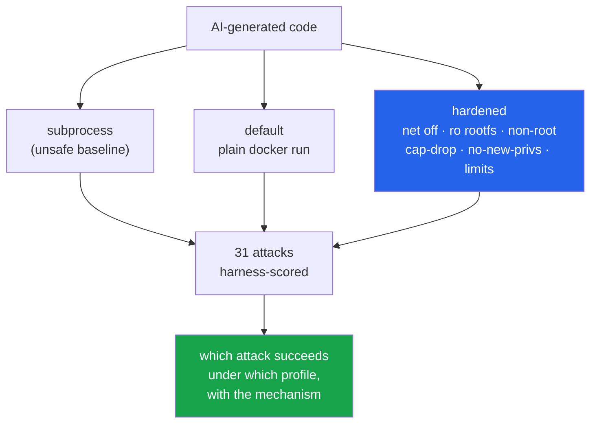

<h1 align="center">agent-sandbox (Docker · cgroups · seccomp · Python)</h1>
<p align="center"><i>Run AI-generated code under named hardening profiles, then measure what each profile actually stops</i></p>

<p align="center">
  <a href="#the-through-line">The through-line</a> &middot;
  <a href="#findings">Findings</a> &middot;
  <a href="#input--output">Input / Output</a> &middot;
  <a href="#quick-start">Quick start</a> &middot;
  <a href="#what-this-does-not-do">What it does NOT do</a> &middot;
  <a href="#problems-hit-while-building-this">Problems hit</a>
</p>

<p align="center">
  
  
  
  <a href="LICENSE"></a>
</p>

---

## The through-line



The suite runs 31 real attack programs — network egress, secret exfiltration, host-path reads,
fork/memory/disk bombs, `/proc` and `/sys` leaks, privilege and capability probes, raw sockets,
time bombs past the timeout, orphan processes, container-to-host surfaces, symlink tricks on
file-out — under three profiles, several repetitions each. **The harness, not the attacker,
decides whether each attack succeeded**, from evidence it can see for itself: a connection that
actually arrived at a host listener, a canary token it planted and then found in captured
output, a marker file whose mtime moved after the run returned.

> **"Docker by itself is a sandbox" is half true and dangerously so. A plain `docker run` gives
> you namespace isolation — fresh filesystem, fresh env, its own network stack — so the naive
> host-level attacks fail. But it still runs your code as root, with a writable root filesystem,
> a broad capability set, a working network, and no resource ceiling. The escapes that plain
> Docker leaves open are exactly the ones the `hardened` profile closes.**

<!-- FINDINGS_TABLE -->

## Findings

<!-- FINDINGS_BODY -->

## Input / Output

<!-- IO_SAMPLES -->

## Quick start

```bash
git clone <this repo>
cd agent-sandbox
uv sync --extra dev

# run code under the hardened profile (needs Docker running)
uv run agent-sandbox run --profile hardened --code "print(2 + 2)"

# see the profiles and their limits
uv run agent-sandbox profiles

# reproduce the finding
uv run agent-sandbox chaos --reps 3 --out results/chaos.json
uv run agent-sandbox latency --warm 6 --out results/latency.json
```

The Python API mirrors the CLI:

```python
from agent_sandbox import Sandbox

sb = Sandbox()
r = sb.run(code="import sys; print(sum(int(x) for x in sys.stdin.read().split()))",
           profile="hardened", stdin="1 2 3 4 5")
print(r.stdout, r.exit_code, r.duration_s)
```

## Layout

```
src/agent_sandbox/
  types.py               RunSpec / RunResult / Limits — what to run, what was observed
  profiles.py            the three named profiles (subprocess / default / hardened)
  runner.py              Sandbox: pick a backend for a profile, apply its safety limits
  latency.py             cold/warm latency + hardening overhead
  cli.py                 run / profiles / chaos / latency / cleanup
  backends/
    docker_cmd.py        pure `docker run` argv builder (unit-tested, no engine)
    docker.py            labelled containers, --rm, kill-by-name, symlink-safe file-out
    subprocess_backend.py the unsafe baseline (host child process)
    base.py              output truncation + symlink-safe file-out reader
  attacks/
    harness.py           HostBeacon (TCP+UDP), ChaosContext, AttackOutcome
    registry.py          31 attacks: payload + harness-side objective check
  chaos.py               run every attack x every profile x N reps, score, report
demo.py                  known-answer demo
scripts/run_chaos.sh     full suite + latency + cleanup
results/                 chaos.json, latency.json — every README number comes from here
```

## Requirements

Python 3.11+, `uv`, and a running Docker engine for the `default`/`hardened` columns (the
`subprocess` baseline and the whole unit-test suite run without one). Only `python:3.12-slim`
is pulled, from Docker Hub. **Zero runtime dependencies** — the package is pure standard library;
`pytest`/`ruff` are dev-only.

## Tests

```bash
uv run pytest -q               # 42 tests
uv run pytest -q -m "not docker"   # unit-only: fakes, no engine, no network
uv run pytest -q -m docker         # integration: real containers (auto-skipped if no engine)
```

Unit tests cover the argv builder, the profiles/limits, every harness-side check (with
fabricated `RunResult`s), the subprocess backend, and the symlink-safe file-out reader. The
Docker-marked tests run real containers and are skipped automatically when no engine is present.
Tests are hermetic: no network (the beacon test is loopback-only), no model, no reliance on data
that grows.

## What this does NOT do

- **It is not a production sandbox.** It is a measurement harness plus a reference hardened
  profile. Use gVisor, Firecracker, or a managed sandbox for untrusted code in production.
- **It does not defeat a kernel exploit.** Every profile shares the host kernel (that is why the
  `kernel_version_leak` attack succeeds under Docker too). A kernel-level escape is out of scope.
- **It does not test seccomp bypasses exhaustively.** It uses Docker's default seccomp profile
  and measures capability/syscall attacks against it; it is not a seccomp fuzzer.
- **The subprocess baseline is intentionally unsafe.** It exists to be beaten, not shipped.

## Problems hit while building this

- **The hardened profile hid the code it was supposed to run.** The first version mounted `/work`
  as a size-capped tmpfs *and* wrote `main.py` to a host dir that was never bound — so the
  container started with an empty `/work` and `python: can't open '/work/main.py'`. A read-only
  rootfs and a writable workspace are not in conflict: `/work` must be a bind mount (a bind
  overrides the read-only rootfs), and only `/tmp` stays a tmpfs. Caught by an integration test
  asserting the run's actual output, not just its exit code.
- **File-out is its own escape.** A program can plant a symlink at a declared output path aimed
  at a host file; a naive reader follows it and hands the caller data from outside the sandbox
  entirely — no container weakness needed. The fix lives in the harness, not the profile:
  `read_files_out` refuses symlinks and any path whose real target escapes the workdir. The
  `symlink_fileout` attack is `blocked` under every profile *because of that guard*, and turning
  it off makes it succeed everywhere.
- **A surprising number was a bug report.** During one run `thread_bomb` came back with "stopped
  at None" — the parser had found no count at all. It turned out the box was running a dozen
  other training jobs and the payload's output was lost under contention, not that the limit
  held. "No count reached the harness" is now reported as an `error`, never silently as a
  `blocked`, so a measurement artefact can never masquerade as a defence that worked.
- **Killing safely on a shared box.** Timeouts must tear down runaway work without touching other
  people's processes. Containers are killed by their unique name; subprocess trees by the exact
  PID launched (`taskkill /T` / `killpg`); a would-be orphan is killed only by the child PID the
  attack itself prints. No pattern-matching kills anywhere.

## Keywords

sandbox &middot; code execution &middot; Docker &middot; container security &middot; seccomp &middot; cgroups &middot; capabilities &middot; AI-generated code &middot; untrusted code &middot; escape testing &middot; network egress &middot; privilege escalation &middot; resource limits &middot; hardening &middot; defence in depth

## License

MIT. Inspired by [daytonaio/daytona](https://github.com/daytonaio/daytona); no code from it is used.
